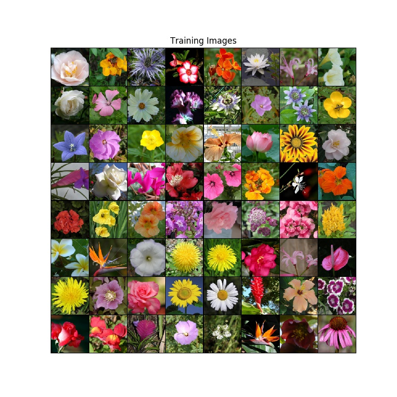
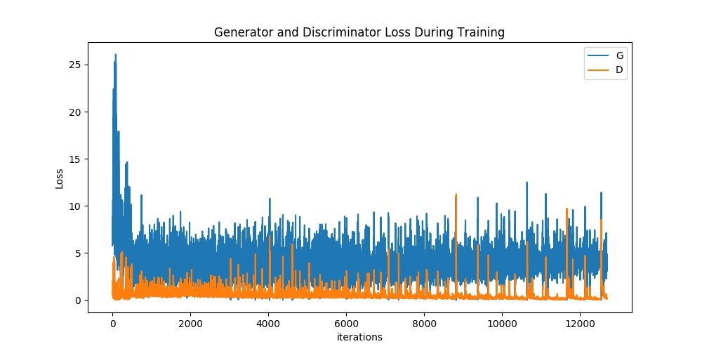
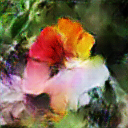

# DCGAN-Pytorch-Alter

Please pay attention to me and star if you like, I will continue to update.  

The default dcgan is used to generate 64 * 64 pictures. In this code repository, we modify the network structure to generate 128 * 128 or 256 * 256 pictures.  

# Environments

torch==1.2.0  
torchvision==0.4.0  
numpy==1.15.1  
matplotlib==3.0.2  
ipython==7.16.1  

# Run Example

First, choose the net in train.py to the model you want to use.  

~~~
from nets.dcgan256 import get_DCGAN   

or  

from nets.dcgan128 import get_DCGAN  

...
~~~ 

Second, prepare the data set and start training.  

~~~
Different parameters in the dcgan64、dcgan96、dcgan128、dcgan256

if use net/dcgan64.py    
python train.py --image_size=64 --ngf=64 --ndf=64  Training effect: good       

if use net/dcgan96.py  
python train.py --image_size=96 --ngf=64 --ndf=64  Training effect: good       

if use net/dcgan128.py  
python train.py --image_size=128 --ngf=32 --ndf=32  Training effect: good    
python train.py --image_size=128 --ngf=64 --ndf=64  Training effect: bad     

if use net/dcgan128_1.py  
python train.py --image_size=128 --ngf=64 --ndf=64  Training effect: good  

if use net/dcgan256.py  
python train.py --image_size=256 --ngf=64 --ndf=64  Training effect: good  

~~~

# Results

### epoch 20:  

### epoch 100:    

  

### example_training_imgs:  

  

### loss_curve:  

### generate 1 * 1 pic:  

### generate 5 * 5 pic:  

### loss_curve:  

# Reference  

PyTorch implementations of Generative Adversarial Networks [9.2k star], implemention of various gan by pytorch [cyclegan, dcgan... ] ： 

https://github.com/eriklindernoren/PyTorch-GAN
